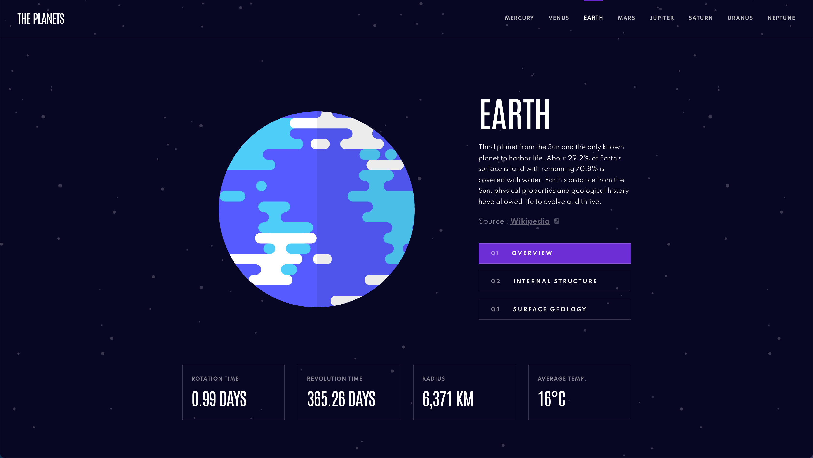

# Planets Fact Site

## Project description

An informative, responsive website about the planets in our solar system. It's one of my first React projects; the aim was to get more familiar with React and put my newly acquired knowledge into practice. It was interesting to learn how to render different components and data on one page, instead of navigating to separate HTML pages.

[**Figma design file**](https://www.figma.com/file/GsCNN3saRZQzBsG1JRgKA1/planets-fact-site?node-id=0%3A1)

## [**View live project**](https://denisehung.github.io/planets-fact-site-react/#/) :rocket:

## Technologies

- HTML
- CSS
- React

## Getting started

**Clone**
```bash
$ git clone https://github.com/denisehung/planets-fact-site-react.git
```
**Launch**
```bash
$ cd planets-fact-site-react
$ npm install
$ npm start
```

## Images



